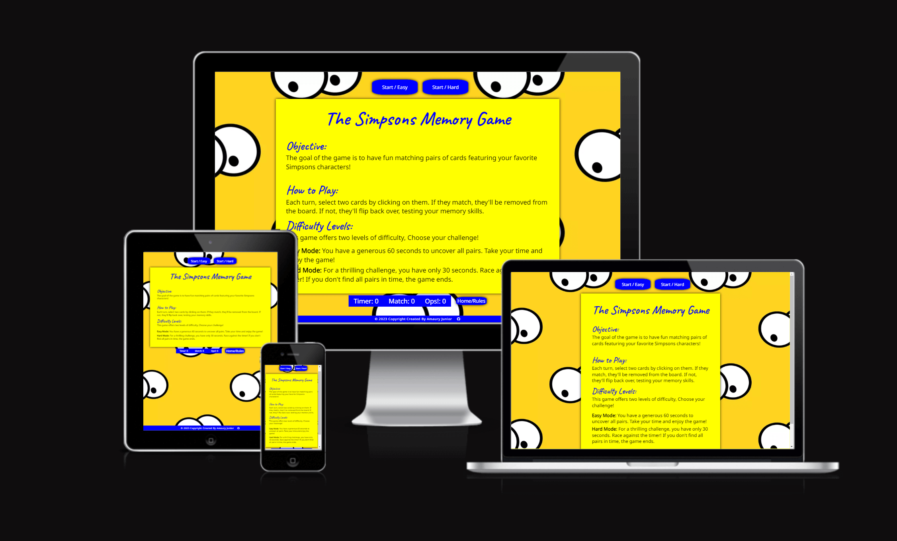

# The Simpsons Memory Game

The Simpsons Memory Game is the result of my second project in the Fullstack Software Development course. This project showcases my skills in JavaScript and my creativity in bringing the beloved Simpsons universe to life in the form of an engaging memory game.

- About the Game:
The Simpsons Memory Game is a web-based game that challenges players to match pairs of cards featuring iconic characters from the animated series "The Simpsons". With vibrant graphics and engaging gameplay, it offers fans of all ages an entertaining way to test their memory and enjoy the beloved characters.

- Target Audience
**Fans of "The Simpsons"** Who want to engage with their favorite characters in a new and entertaining way.

**Memory game enthusiasts** looking for a themed and visually engaging experience. Players of all ages, from kids to adults, who can appreciate the challenge and fun of a memory game.

[**Live Website: The Simpsons Memory Game**] (<https://afjunior18.github.io/Simpsons-Memory-Game/>)

## Content

## User Experience (UX)

### New User

- Easy Game Start: As a new user, I want to be able to start a new game with ease and understand the game's objective right away.

Testing: The game presents a prominent "Start Game" button, providing a straightforward way to initiate gameplay. A brief instruction is also displayed to clarify the objective.

- Choose Your Challenge: As a new user, I want the option to select between different difficulty levels so I can tailor the game to my preference and skill level.

Testing: The game offers two distinct difficulty levels - "Easy" and "Hard". Each level is clearly labeled with an appropriate description to help users make an informed choice.

### Returning User

- Track Your Progress (Future Implementation): As a returning user, I would like to see my previous scores and performance to track my progress and aim for improvement. While this feature is not yet implemented, we plan to add it in future updates.

- Quick Restart: As a returning user, I want the ability to swiftly start a new game without unnecessary steps, providing a good gaming experience.

Testing: The game provides a "Start/Easy and Start/Hard" button that allows users to instantly initiate a new game, maintaining the flow of gameplay without interruptions.
