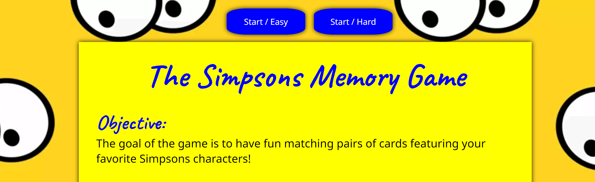
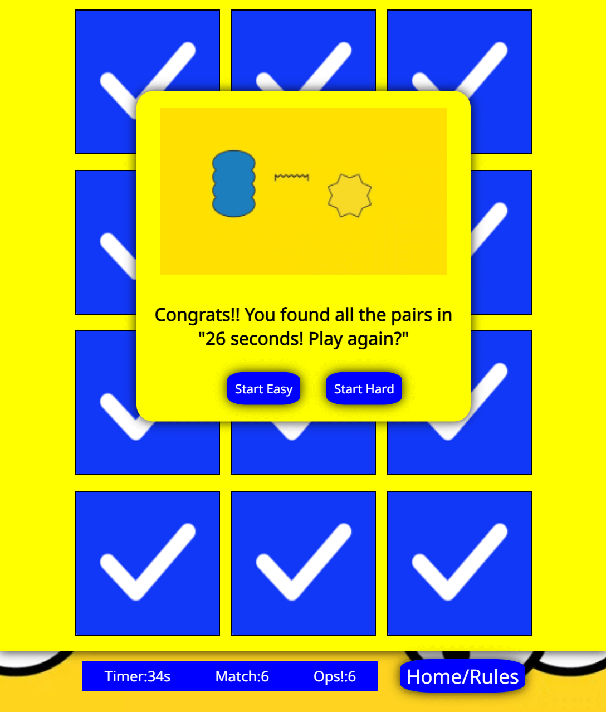
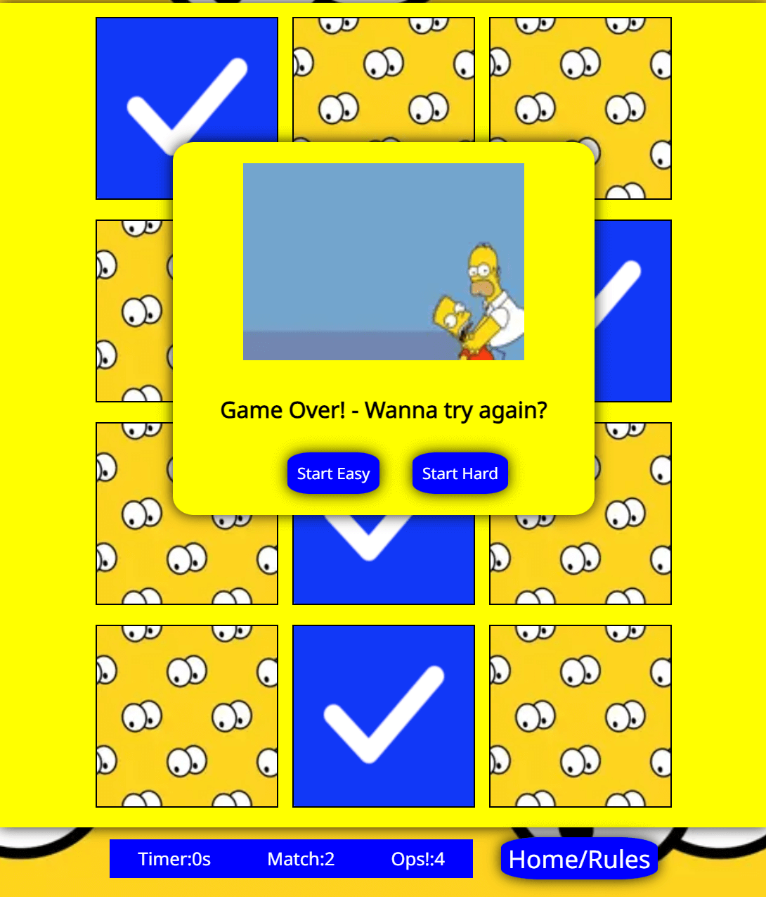

# The Simpsons Memory Game

The Simpsons Memory Game is the result of my second project in the Fullstack Software Development course. This project showcases my skills in JavaScript and my creativity in bringing the beloved Simpsons universe to life in the form of an engaging memory game.

About the Game:
The Simpsons Memory Game is a web-based game that challenges players to match pairs of cards featuring iconic characters from the animated series "The Simpsons". With vibrant graphics and engaging gameplay, it offers fans of all ages an entertaining way to test their memory and enjoy the beloved characters.

Target Audience: Fans of "The Simpsons" Who want to engage with their favorite characters in a new and entertaining way and memory game enthusiasts looking for a themed and visually engaging experience. Players of all ages, from kids to adults, who can appreciate the challenge and fun of a memory game.

[**Live Website: The Simpsons Memory Game**] (<https://afjunior18.github.io/Simpsons-Memory-Game/>)

## Content

## User Experience (UX)

### New User

- Easy Game Start: As a new user, I want to be able to start a the game with ease and understand the game's objective right away.

Testing: The game presents a prominent "Start Game" button, providing a straightforward way to initiate gameplay. A brief instruction is also displayed to clarify the objective.

- Choose Your Challenge: As a new user, I want the option to select between different difficulty levels so I can tailor the game to my preference and skill level.

Testing: The game offers two distinct difficulty levels - "Easy" and "Hard". Each level is clearly labeled with an appropriate description to help users make an informed choice. 

### Returning User

- Track Your Progress (Future Implementation): As a returning user, I would like to see my previous scores and performance to track my progress and aim for improvement. While this feature is not yet implemented, we plan to add it in future updates.

- Quick Restart: As a returning user, I want the ability to swiftly start a new game without unnecessary steps, providing a good gaming experience.

Testing: The game provides a "Start/Easy and Start/Hard" button that allows users to instantly initiate a new game, maintaining the flow of gameplay without interruptions. .

## Design Choices

### Typography

Heading: The font chosen for the game heading is: font-family: 'Caveat', cursive, sans-serif.

Body: The font used for the card text is: font-family: 'Noto Sans', sans-serif;

Both styles were sourced from Google Fonts and to ensure they complement each other and enhance the overall visual appeal of the game by using the website <https://www.fontpair.co/all>.

### Colour Scheme

The game, themed around The Simpsons, incorporates vibrant and familiar colors associated with the show. The primary colors used are:

- Yellow (#FFD700): This color represents the iconic skin tone of the Simpson family members.

- Blue (#0000FF): This color is synonymous with the animated show's logo and various characters.

These colors were selected to evoke nostalgia and create a visually engaging experience for players, reminiscent of the beloved TV series.

Color Inspiration: These design choices were made to capture the essence of The Simpsons and create an enjoyable and visually appealing gaming experience.

### Imagery

For my game, I selected images that align with The Simpsons theme. These images were sourced from:

- Shutterstock: <https://www.shutterstock.com/>

- wallpapers.com: <https://wallpapers.com/simpsons>

- All free download: <https://all-free-download.com/free-vector/the-simpsons-images.html>

### Game Layout

The game layout is designed to provide an intuitive and enjoyable experience for players. It features a game board where users can interact with cards based on The Simpsons characters. The layout includes:

Game Board: This is the main area where players interact with the cards and try to find matching pairs.

Game Controls: Buttons like "Start Game" and "Hard Level" allow users to initiate and adjust the difficulty level of the game.

Timer and Statistics: The game displays a timer to track the time taken to complete the game, as well as statistics like the number of successful matches and incorrect attempts.

Messages: Messages like "Game Over" and "You Win" provide feedback to the user based on their performance.
 

### Wireframe

To plan the game's layout and functionality, I utilized the Balsamiq tool to create a wireframe. This served as a preliminary visual representation.These elements combined to form an engaging and user-friendly game centered around The Simpsons theme.

