# The Simpsons Memory Game

The Simpsons Memory Game is the result of my second project in the Fullstack Software Development course. This project showcases my skills in JavaScript and my creativity in bringing the beloved Simpsons universe to life in the form of an engaging memory game.

**About the Game**: The Simpsons Memory Game is a web-based game that challenges players to match pairs of cards featuring iconic characters from the animated series "The Simpsons". With vibrant graphics and engaging gameplay, it offers fans of all ages an entertaining way to test their memory and enjoy the beloved characters.

**Target Audience**: Fans of "The Simpsons" Who want to engage with their favorite characters in a new and entertaining way and memory game enthusiasts looking for a themed and visually engaging experience. Players of all ages, from kids to adults, who can appreciate the challenge and fun of a memory game.

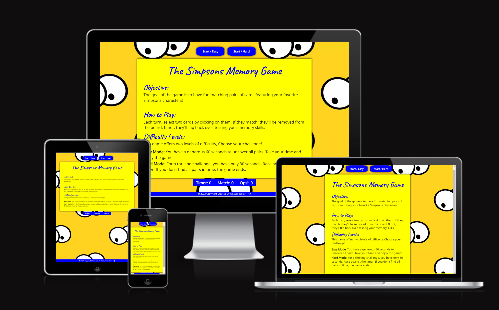

[**Live Website: The Simpsons Memory Game**](https://afjunior18.github.io/Simpsons-Memory-Game/)

## User Experience (UX)

### New User

- Easy Game Start: As a new user, I want to be able to start a the game with ease and understand the game's objective right away.

    The game presents a prominent "Start Game" button, providing a straightforward way to initiate gameplay. A brief instruction is also displayed to clarify the objective.

- Access to Game Rules: As a New user, I would like to easily locate and understand the rules of the game.  

    The rules are prominently displayed on the first page, ensuring immediate visibility for users. A button beneath the game board allows easy access back to the rules, providing a convenient reference during gameplay. This design facilitates a smooth and informative user experience.

- Choose Your Challenge: As a new user, I want the option to select between different difficulty levels so I can tailor the game to my preference and skill level.  

    The game offers two distinct difficulty levels - "Easy" and "Hard". Each level is clearly labeled with an appropriate description to help users make an informed choice.  

### Returning User

- Track Your Progress (Future Implementation): As a returning user, I would like to see my previous scores and performance to track my progress and aim for improvement. While this feature is not yet implemented, we plan to add it in future updates.

- Quick Restart: As a returning user, I want the ability to swiftly start a new game without unnecessary steps, providing a good gaming experience.

    The game provides a "Start/Easy and Start/Hard" button that allows users to instantly initiate a new game, maintaining the flow of gameplay without interruptions.

## Wireframe

To plan the game's layout and functionality, I utilized the Balsamiq tool to create a wireframe. This served as a preliminary visual representation.These elements combined to form an engaging and user-friendly game centered around The Simpsons theme.

[Desktop Wireframe](docs/wireframe-desktop.png)

[Ipad Wireframe](docs/wireframe-ipad.png)

[Mobile Wireframe](docs/wireframe-mobile.png)

## Design Choices

### Typography

Heading: The font chosen for the game heading is: font-family: 'Caveat', cursive, sans-serif.

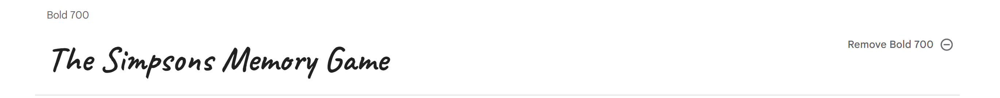

Body: The font used for the card text is: font-family: 'Noto Sans', sans-serif;

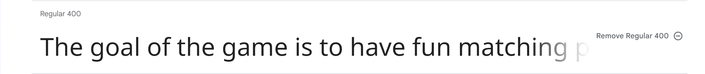  

Both styles were sourced from Google Fonts and to ensure they complement each other and enhance the overall visual appeal of the game by using the website <https://www.fontpair.co/all>.

### Colour Scheme

The game, themed around The Simpsons, incorporates vibrant and familiar colors associated with the show. The primary colors used are:

- Yellow: This color represents the iconic skin tone of the Simpson family members.

- Blue: This color is synonymous with the animated show's logo and various characters.

These colors were selected to evoke nostalgia and create a visually engaging experience for players, reminiscent of the beloved TV series.

Color Inspiration: These design choices were made to capture the essence of The Simpsons and create an enjoyable and visually appealing gaming experience.

### Imagery

For my game, I selected images that align with The Simpsons theme. These images were sourced from:

- [Shutterstock](https://www.shutterstock.com/)

- [wallpapers.com](https://wallpapers.com/simpsons)

- [All free download](https://all-free-download.com/free-vector/the-simpsons-images.html)

## Features

### Game Layout

The game layout is designed to provide an intuitive and enjoyable experience for players. It features a game board where users can interact with cards based on The Simpsons characters. The layout includes:

**Game Board Rules**:The rules are prominently displayed on the first page, ensuring immediate visibility for users. A button beneath the game board allows easy access back to the rules.

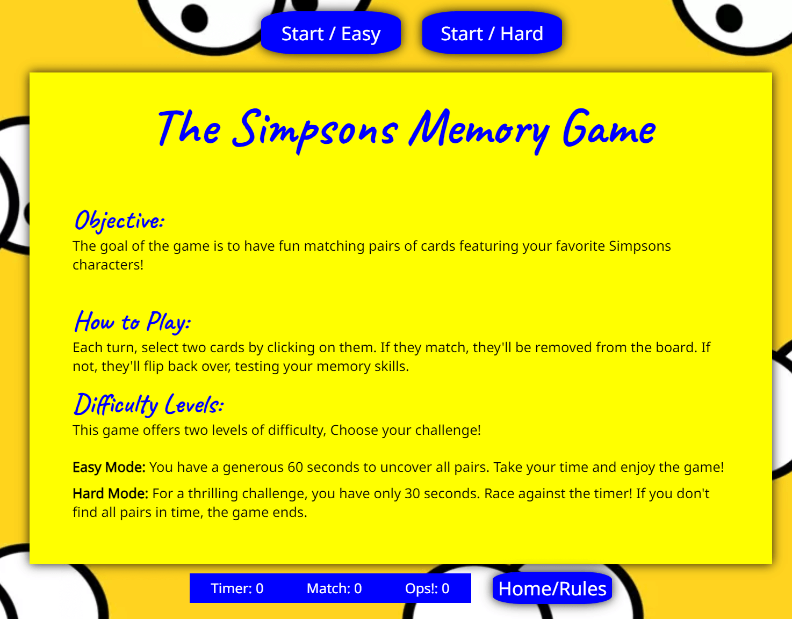  

**Game Board**: This is the main area where players interact with the cards and try to find matching pairs.

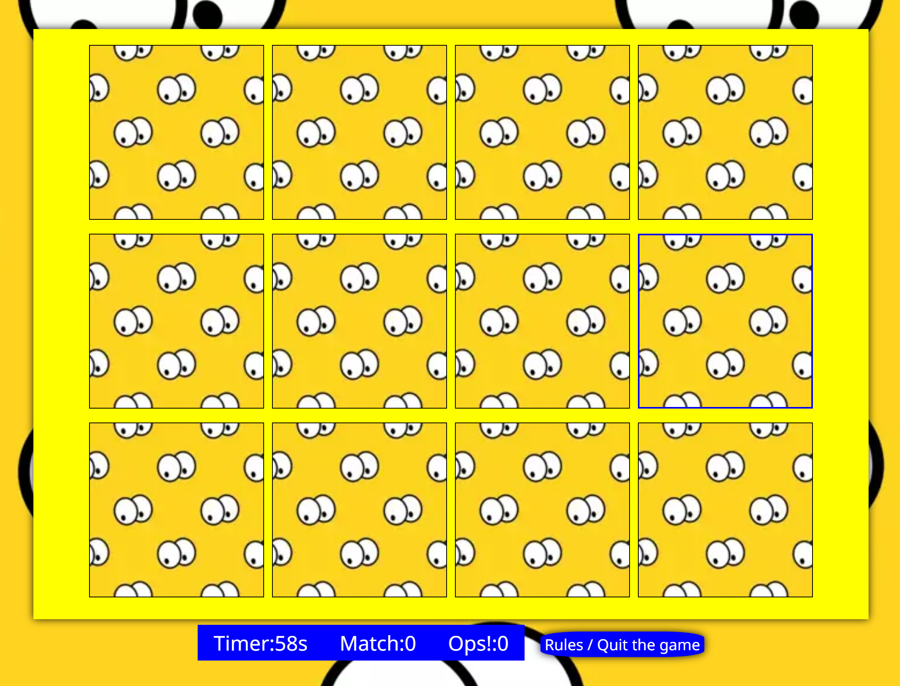

**Game Controls**: Buttons like "Start/Easy" and "Start/Hard" allow users to initiate and adjust the difficulty level of the game.

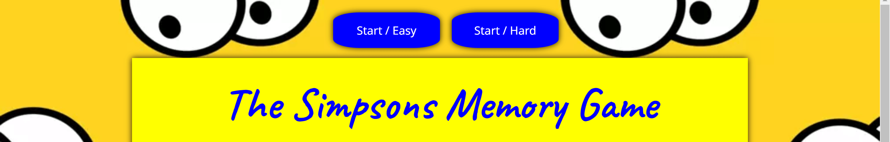

**Timer and Statistics**: The game displays a timer to track the time taken to complete the game, as well as statistics like the number of successful matches and incorrect attempts.

**Messages Box**: Messages like "Game Over" and "You Win" provide feedback to the user based on their performance.  

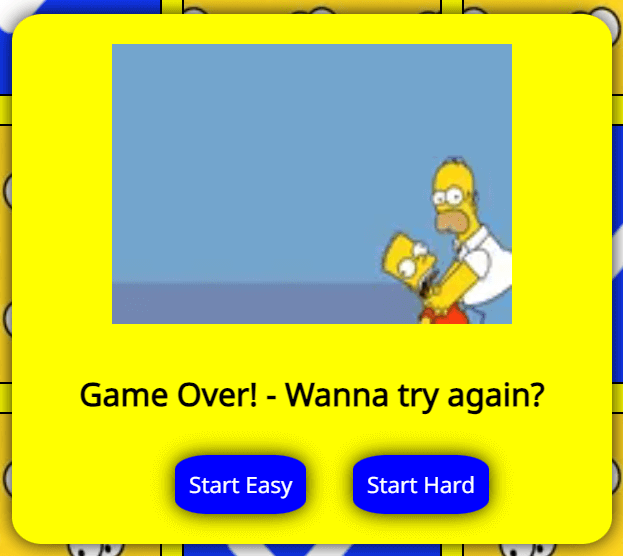  

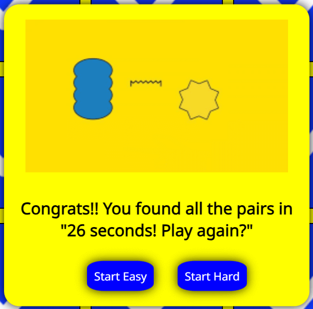  

**Responsive Design**: The game is designed to be accessible and enjoyable on various devices, including desktops, tablets, and mobile phones. This ensures a seamless experience for all players, with the project being developed from max-height 4000px to min-height 204px. with the next project, the development approach will shift from small screen to big screen, as it is believed to be a more effective strategy in handling media queries.

**Favicon**: A custom favicon has been added to enhance the user experience. This small but noticeable detail adds a personalized touch to the browser tab. 

## Technologies Used

### Languages Used

- HTML
- CSS
- JavaScript

### Frameworks, Libraries, and Programs

- [Balsamiq](https://balsamiq.com/): Used for creating wireframes.
- [GitHub](https://github.com/): Used for website deployment.
- [Font Awesome](https://fontawesome.com/): A library of icons and symbols used for the webpage.
- [Google Fonts](https://fonts.google.com/): Imported fonts for the website.
- Images
  - [Shutterstock](https://www.shutterstock.com/)
  - [Wallpapers](https://wallpapers.com/simpsons)
  - [All-Free-Download](https://all-free-download.com/free-vector/the-simpsons-images.html)
- Paint: Used to edit screenshots and convert image extensions for the readme file.
- [Am I Responsive](https://ui.dev/amiresponsive): Used to check how the website responds on various screens.
- Chrome Dev Tools: Frequently used to experiment with code and preview on different screens.
- [TinyPNG](https://tinypng.com/): Used for compressing and optimizing images to improve performance.
- [Simple Image Resizer](https://www.simpleimageresizer.com/): Used for resizing images.
- Unicorn Revealer: Chrome extension for debugging layout issues and visualizing hidden properties on webpages.
- [Animate.css](https://animate.style/): Used for animations.
- [W3Schools CSS3 Animations](https://www.w3schools.com/css/css3_animations.asp): Used for creating animations, especially for titles.
- [Favicon.io](https://favicon.io/): Used for creating the favicon.
- [Icons](https://fontawesome.com/): A comprehensive library of icons and symbols.

## Testing

### HTML Validation

- <https://validator.w3.org/>

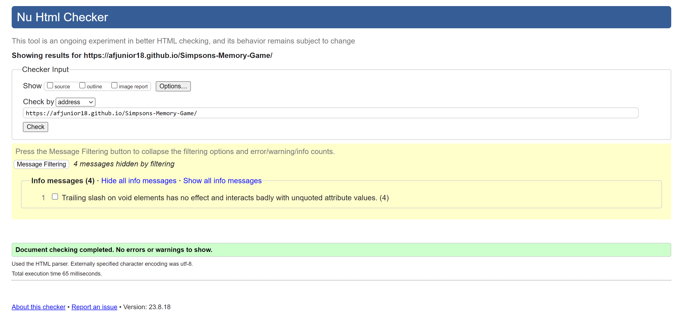

### CSS Validation

- <https://jigsaw.w3.org/css-validator/>

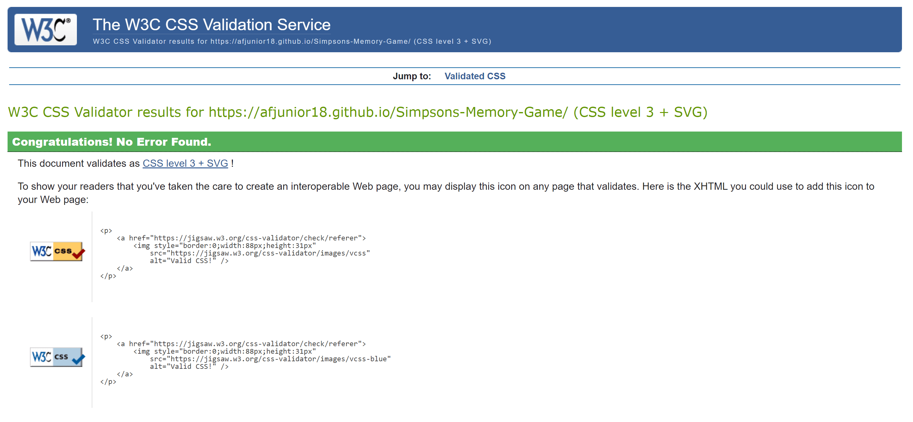

### JavaScript Validation

- <https://jshint.com/>

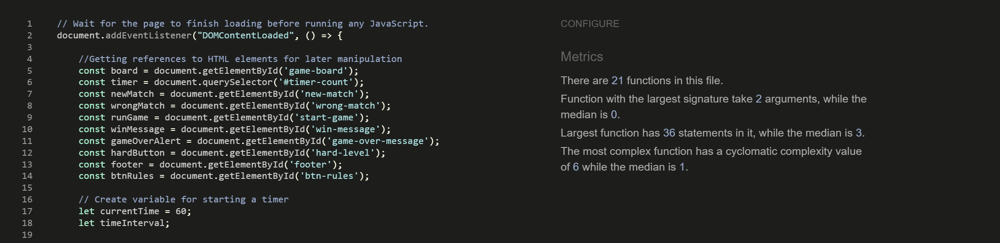

### Lighthouse tool

I used Lighthouse in DevTools to assess and optimize the performance, accessibility, best practices and SEO.

- **Desktop - Index.html**

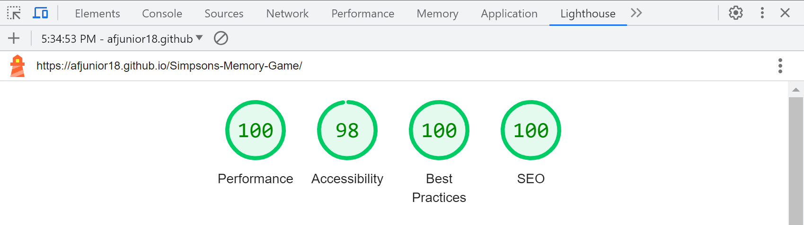

- **Mobile - Index.html**

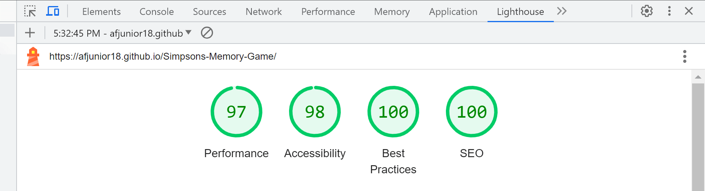

### Wave Validation

- I used the WAVE (Web Accessibility Evaluation Tool) validation to ensure that our website adheres to accessibility standards and guidelines.

    [Wave Validation](docs/validator-wave-01.png)

## Bugs and Fixes

- Bug: Dynamic Board Size
Description: Initially, the game board size would shrink as pairs were matched and removed, resulting in a dynamically changing play area.

    **Resolution**: To address this, a static image representing all matched pairs was used. This ensured a consistent board size throughout the game.

- Bug: Styling Alert Messages
Description: Styling alert messages proved challenging. The decision was made to create a custom function for displaying messages with desired styles. However, a new issue arose where the win message remained visible on the board after starting a new game.

    **Resolution**: To fix this, a function was implemented to hide the win message whenever a new game was initiated, regardless of the chosen difficulty level.

- Bug: Border artifact on initial card click. When starting the first game and clicking on cards, a minor artifact appeared as a faint black border in the middle of the cards. Various attempts were made to rectify the issue.
  
    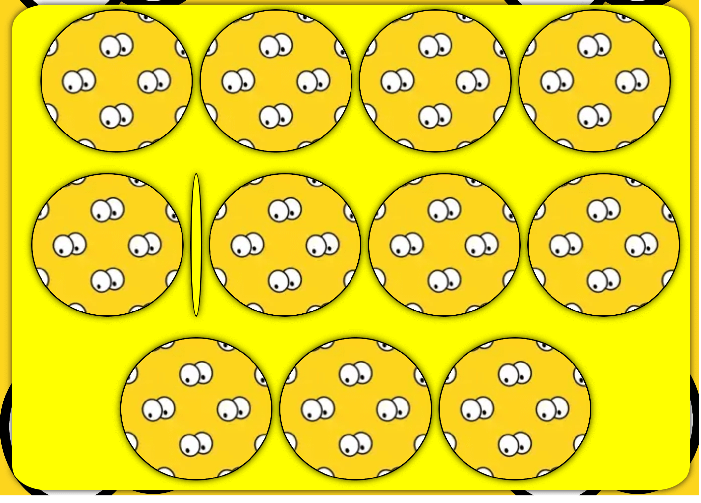

    **Attempts:**
Verified image and container sizes using the Unicorn Revealer tool, a Google Chrome extension.
  
    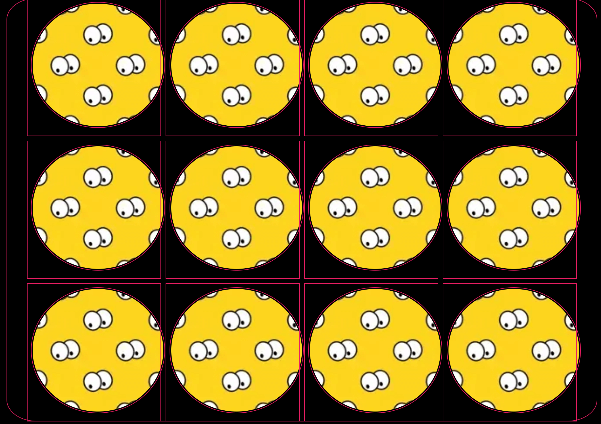

    Adjusted spacing between each div on the board.
    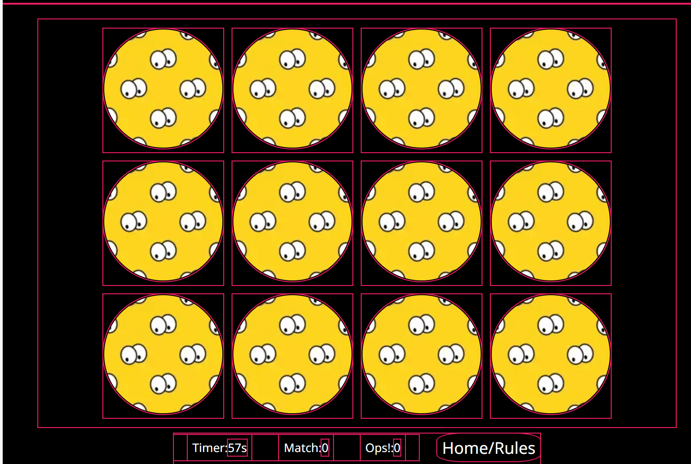

    Initially applied a border-radius: 50% to each card, but observed that it exacerbated the black border issue, prompting the removal of this property.

    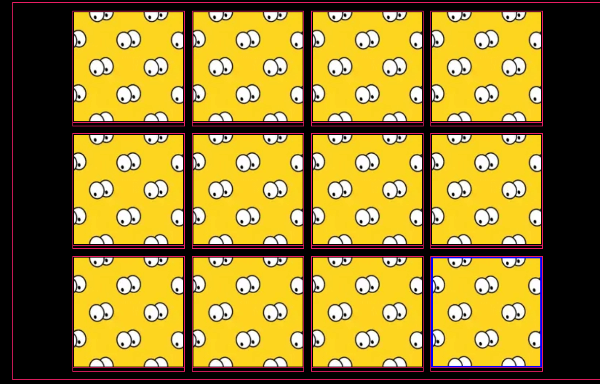

    **Result**: While the mentioned adjustments led to a significant improvement, a slight border artifact still persisted on the initial clicks of each game. Further investigation is required for a complete resolution.

## Deployment

1.GitHub Account: Begin by creating an account on github.com. The platform is free to use.

2.Repository Creation: Create a repository to host your website. Click the "+" button on the main page, then select "New Repository."

3.Repository Details: Provide a name, description, and set it to public.

4.Access Repository Settings: Navigate to the repository settings.

5.GitHub Pages Section: Locate this section within the settings.

6.Branch Selection: Choose the "main" branch for deployment.

7.Save Changes: Save the settings to initiate the deployment process.

8.Deployment in Progress: Wait for the confirmation message indicating successful deployment.

9.Accessing the Live Site: Retrieve the link to your deployed website.

10.Share the Link: Share the provided link with others.

Explore the Deployed Website: Visit the live site by clicking on the following link: [Live Website](https://afjunior18.github.io/Simpsons-Memory-Game/)

## Credits

To the videos that were crucial in completing this project:

- [Countdown Timer Tutorial](https://www.youtube.com/watch?v=PIiMSMz7KzM): Provided invaluable guidance on implementing the timer/countdown feature.

- [Memory Game Tutorial (YouTube)](https://www.youtube.com/watch?v=0SeqdHCBYVo): This tutorial jumpstarted the development of my project and significantly aided in understanding the creation of the game board, which proved to be the most challenging aspect.

- [Memory Game Tutorial (Marina Ferreira)](https://marina-ferreira.github.io/tutorials/js/memory-game.pt-br/): This tutorial served as a crucial source of guidance and inspiration throughout the development process. It provided detailed instructions and practical examples that were essential for the successful implementation of the memory game.

- A big thanks to my mentor, [David Bowers](https://github.com/dnlbowers), for his invaluable feedback and guidance. His insights were key in improving the final project.
